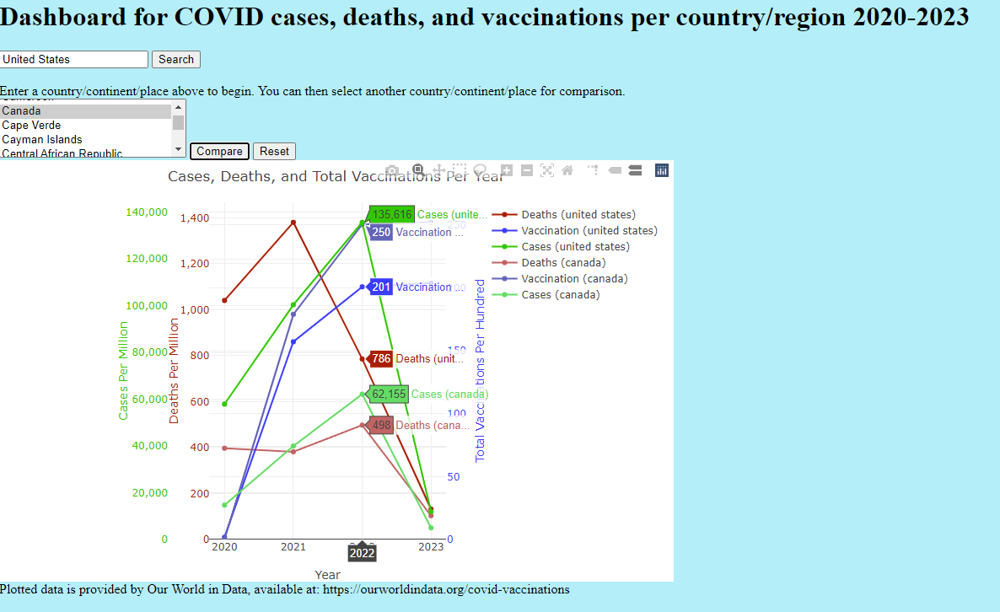

# Covid-19 Statistical Dashboard Project

This repository contains the code for the Interactive Covid Statistical Dashboard, which was developed as a project part of the Vanderbilt Data Analytics Bootcamp in 2023. The project focuses on creating a website with multiple visualization tools for analyzing the relationships between COVID deaths and infections, population density, tourism, and vaccination within a country.

# Goal
The intent was to answer four hypothesis:

1. The incidence of COVID-19 cases and deaths is greater in countries with lower vaccination rates
  
2.	Countries with higher tourist traffic experience higher COVID-19 infection rates in 2020.

3.	Population density and infection rates are correlated. 
	
4.	Countries with notoriously high COVID-19 cases have stricter and longer lockdown measures 

# How to Run the Code
#### To run the code, follow the steps below if using MongoDB (Deprecated):

1. Ensure that you have a MongoDB local server running and all neccessary dependencies installed that are listed above.
2. Import the "owid_covid_data" collection into your local MongoDB database. The collection can be imported from the file databases/local.owid_covid_data.json.
3. Run the file Dashboard/app.py. This will launch the website using Flask.

#### Current version is using JSON API. Follow the following steps below:

1. Ensure that you have the necessary dependencies installed that are listed above
2. Start the Flask server by running the command `python app.py` inside a terminal such as Git Bash. Make sure you are in the Dashboard directory.
3. Once the server is running, the JSON API will be accessible through the defined endpoints.

# Project Files
The root directory of this repository contains the following files:

• CSV: Where our data was being housed

• Dashboard: Main hub where app.py is located to run the code. All final HTML, JavaScript, and CSS files are located here.

• Implementation_pngs: Implentation pictures displaying the results.

• Databases: JSON files for flask. MongoDB was originally used to house our dataset

• hypothesis 3_population-infection: Code in process for toggable map by year not implemented.

• Python : Early Webscrapping work and additional visualizations included in presentation.

• Group 3 Presentation.pptx: Powerpoint going over our findings.

• Group1ProposalProject3.docx: The initial written proposal for this project. It outlines the project objectives and goals.

• High-level workflow list.docx: Methodology used for this project.

• layout.pdf: The original layout idea for the project. Please note that the final implementation may have some differences due to feasibility considerations, but it generally addresses the original intent.

Feel free to explore the code and project files to understand the implementation details and how the visualizations were created.

# Implementation
Upon successful running app.py, you will arrive at the main dashboard

The "Go to Continent Map (Case Data)" will pull up a map as shown below where each continent can be interacted with showing Covid Cases, recovery, and recovery rate.

The "Go to Country Map (Vaccine Data)" shows country population and total vaccinations. Visualization of color was implemented by the vaccination rate of the country as shown below.

The "Go to Vaccine Only Dashboard" allows users the ability to select a country and/or date to see the vaccination data. A compare feature was implemented to allow comparisons between countries as seen by the following picture.

The "Go to Covid Cases, Deaths, Vaccine by Country Dashboard" adds more depth to the previous dashboard showcasing deaths, vaccinations, and cases for a specified country maintaining the interactivity of specifying the country and allowing comparisons as shown below.

The Go to Lockdown Measures showcases each country that can be selected from the dropdown menu how many total measures were implemented on a month by month basis as demonstrated below.

The "Go to Tourism" highlights tourism in a country that can be selected by a dropdown menu displaying their tourism data and infection for the year. The compare tool allows access to compare countries as shown below.

# Analysis

Our project found that the incidence of COVID-19 deaths is lower in countries with higher vaccination rates. 
Furthermore, our analysis revealed that there are other factors beyond vaccination status that can impact the spread and outcomes of COVID-19. These include demographic factors such as tourism, population density, and government intervention in the form of lockdown measures

# Credits
Team responsible for the formation of this project:

Andrew Lounsbury: (https://github.com/a676-code)

Kirill Zavalin: (https://github.com/KZavalin)

Joshua Aldridge: (https://github.com/B-Aldridge)

Madi Subaiti: (https://github.com/mssubaiti)

Seth Beverley: (https://github.com/SNbeverley)

# Data Sources
The following data sources are what was primarily used for this project:

[World Health Organization (WHO) COVID-19 Data](https://covid19.who.int/data): The project scraped data from this website to gather COVID-19 related information such as deaths, infections, and vaccinations.

[Worldometer](https://www.worldometers.info/coronavirus/): This website was also scraped to collect COVID-19 data, including deaths and infections.

[Our World In Data](https://ourworldindata.org/covid-vaccinations): This website was used to download the CSV file with Covid-19 data which contained a large portion of the metrics used.

[World Bank](https://data.worldbank.org/indicator/ST.INT.ARVL?end=2020&start=2020&view=map&year=2020): This website was used to download a csv of tourism data for our visualization.

